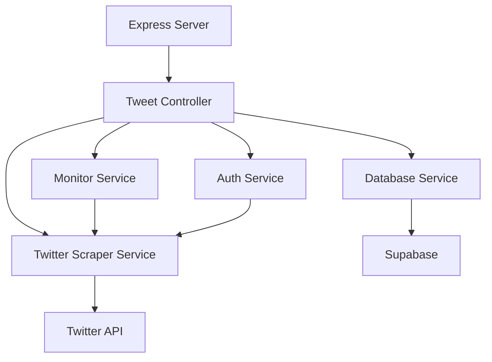

# Twitter Bot Service 🤖

A TypeScript-based Twitter bot service that monitors mentions and automatically responds with "sorry funds not available". Built with Express.js and Supabase for data persistence.

## Features 🌟

- **Automated Mention Responses**: Automatically responds to mentions with a predefined message
- **Quote Tweet Monitoring**: Tracks and stores quote tweets for monitored tweets
- **Persistent Storage**: Uses Supabase to store tweet data and interactions
- **Cookie-based Authentication**: Secure Twitter authentication using cookies
- **Real-time Monitoring**: Checks for new mentions every 30 seconds
- **REST API Endpoints**: Express.js based API for tweet management

## Tech Stack 💻

- **Backend**: Node.js + Express.js + TypeScript
- **Twitter Integration**: agent-twitter-client
- **Database**: Supabase
- **Scheduling**: node-cron
- **Authentication**: Cookie-based Twitter auth

## Architecture Diagram 🏗️



## API Endpoints 🛣️

- `POST /tweet`: Create a new tweet
  - Body: `{ "text": "Tweet content" }`
  - Response: Tweet object with monitoring status

## Database Schema 📊

**tweets table**

- `id`: string (primary key)
- `text`: string
- `created_at`: timestamp
- `author_id`: string
- `is_quote_tweet`: boolean
- `original_tweet_id`: string (nullable)

## Environment Variables 🔐

```env
PORT=3001
TWITTER_USERNAME=your_username
TWITTER_PASSWORD=your_password
TWITTER_EMAIL=your_email
TWITTER_COOKIES=your_cookies
TWITTER_CT0=your_ct0
SUPABASE_URL=your_supabase_url
SUPABASE_ANON_KEY=your_supabase_key
```

## Getting Started 🚀

1. Clone the repository
2. Install dependencies:
   ```bash
   npm install
   ```
3. Set up environment variables in `.env`
4. Run development server:
   ```bash
   npm run dev
   ```

## Available Scripts 📜

- `npm run dev`: Start development server with hot-reload
- `npm run build`: Build TypeScript to JavaScript
- `npm run watch`: Watch mode for TypeScript compilation
- `npm start`: Run production server

## Project Structure 📁

```
src/
├── app.ts                 # Application entry point
├── config/               # Configuration files
├── controllers/          # Request handlers
├── routes/              # API routes
├── services/            # Business logic
└── types/               # TypeScript type definitions
```

## Contributing 🤝

1. Fork the repository
2. Create your feature branch
3. Commit your changes
4. Push to the branch
5. Open a Pull Request

## License 📄

ISC
